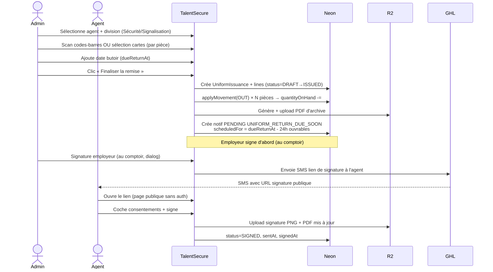
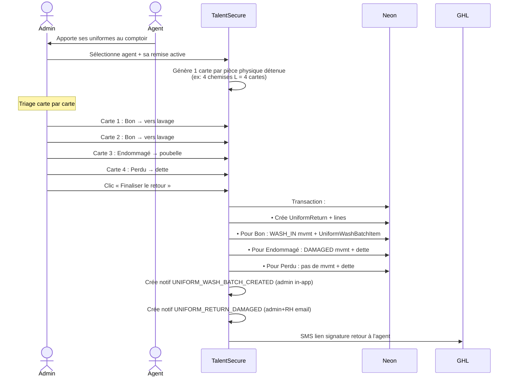
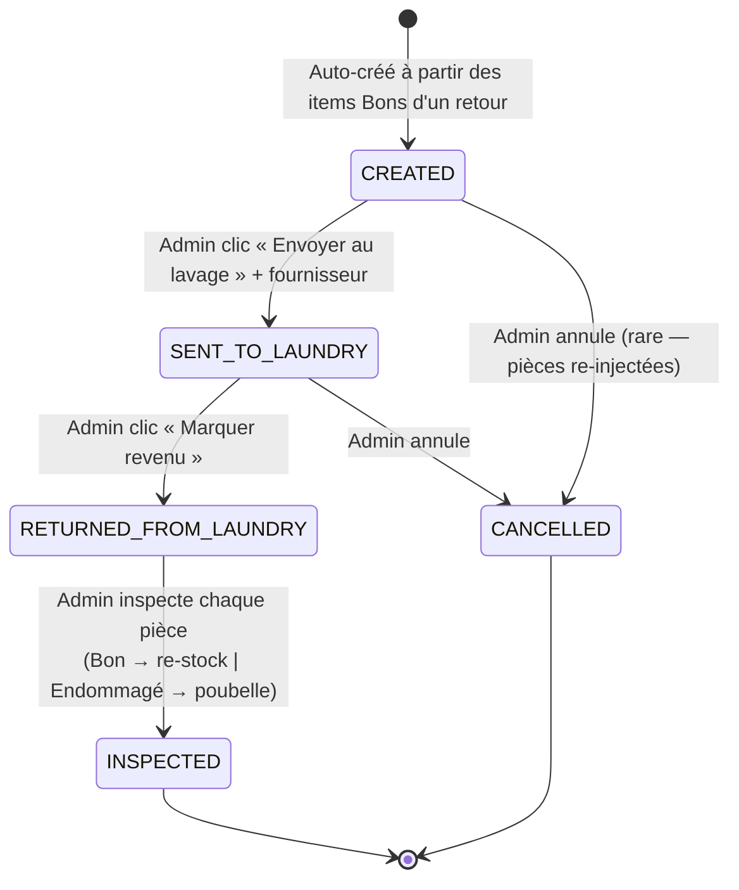
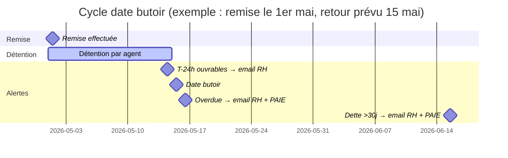
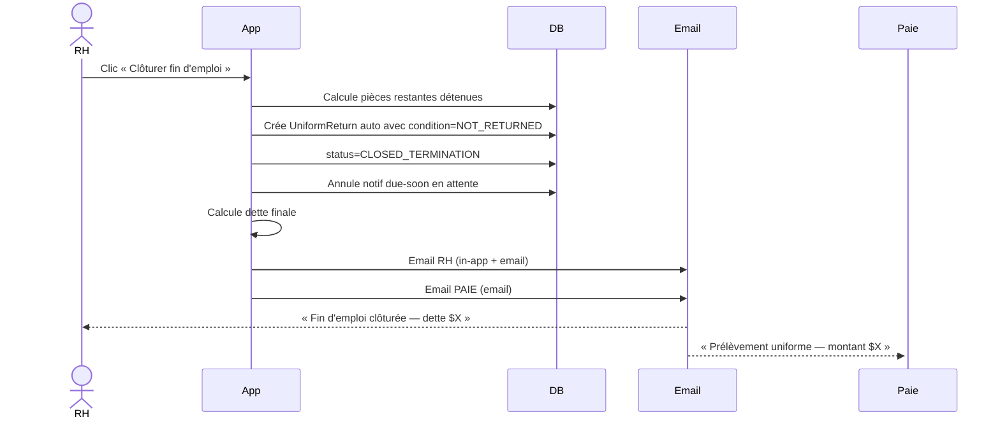

# Module Uniformes — Architecture complète

> Document de référence pour l'équipe XGuard.
> Décrit le **cycle de vie complet** d'une pièce d'uniforme : du moment où elle entre dans
> l'inventaire jusqu'à sa sortie définitive (re-stock après lavage ou poubelle), avec
> **tous les acteurs**, **toutes les notifications** (SMS + email + cloche in-app), et
> les escalations automatiques.

---

## 1. Vision

XGuard remet des uniformes à ~1300 agents. Le système doit :

1. **Traquer chaque pièce** physiquement (qui la détient, où elle en est).
2. **Décrémenter le stock à la remise**, **ré-incrémenter au retour** — mais SEULEMENT après
   lavage et inspection (pas direct comme avant).
3. **Faire respecter les délais** (date butoir de retour) avec **escalations automatiques**.
4. **Calculer la dette** d'un agent (pièces perdues/endommagées) et la communiquer à la **paie**.
5. **Alerter aux moments-clés** (RH, Admin, Paie) pour ne rien oublier.

---

## 2. Acteurs & responsabilités

| Acteur | Rôle | Accès |
|---|---|---|
| **Admin / RH** (`ADMIN`, `RH_RECRUITER`) | Gère catalogue, inventaire, remises, retours, lots de lavage, fins d'emploi | App TalentSecure complète |
| **Agent** (`Employee`) | Reçoit uniforme, signe formulaire, retourne en fin d'emploi | Lien public de signature (SMS) |
| **Buanderie / Fournisseur lavage** | Reçoit/lave/retourne les lots | Pas d'accès app (suivi côté Admin) |
| **rh@xguard.ca** | Alertes proactives (dates butoirs, dettes anciennes) | Email |
| **paie@xguard.ca** | Alertes finales (montants à prélever) | Email |

---

## 3. Stack technique

```
┌─────────────────────────────────────────────────────────────┐
│                       FRONTEND                              │
│  React 18 + Vite + MUI + React Query + Zustand              │
│  • /uniformes (Catalogue, Inventaire, Remise, Retour,       │
│                 Lots lavage, Rapports)                       │
│  • Cloche notifications (header)                            │
│  • Page publique signature (/uniformes/signer/:token)       │
└────────────────────────┬────────────────────────────────────┘
                         │ HTTPS
┌────────────────────────▼────────────────────────────────────┐
│                       BACKEND                               │
│  Express + Prisma + node-cron (Cloud Run, min-instances=1)  │
│                                                             │
│  ┌─ Controllers ────────────┐  ┌─ Services ────────────┐    │
│  │ uniform.controller       │  │ uniform-stock          │    │
│  │ uniform-issuance         │  │ uniform-wash-batch     │    │
│  │ uniform-return           │  │ uniform-pdf            │    │
│  │ uniform-wash-batch       │  │ uniform-barcode        │    │
│  │ notification             │  │ notification           │    │
│  └──────────────────────────┘  │ ghl-email              │    │
│                                │ sms                    │    │
│  ┌─ Scheduler (node-cron) ─┐   │ email (nodemailer)     │    │
│  │ • Dispatch 5min         │   │ r2 (Cloudflare)        │    │
│  │ • Surveillance 1h       │   └────────────────────────┘    │
│  └─────────────────────────┘                                │
└─┬───────────┬──────────┬──────────┬────────────────────────┘
  │           │          │          │
  ▼           ▼          ▼          ▼
┌────────┐ ┌───────┐ ┌────────┐ ┌───────────┐
│ Neon   │ │ R2    │ │ GHL    │ │ Gmail SMTP│
│ PG     │ │ (PDF, │ │ (SMS+  │ │ (fallback │
│        │ │ sigs) │ │ Email) │ │  email)   │
└────────┘ └───────┘ └────────┘ └───────────┘
```

---

## 4. Modèle de données (Prisma)

**11 tables principales** :

| Table | Rôle |
|---|---|
| `uniform_items` | Catalogue (ex: « Chemise grise (ML) ») |
| `uniform_variants` | Variantes par taille (1 code-barres par variante) |
| `uniform_stock_movements` | **Ledger immuable** — source de vérité du stock |
| `uniform_issuances` | Remises (en-tête) |
| `uniform_issuance_lines` | Lignes de remise (1 par pièce, qty=1) |
| `uniform_returns` | Retours (en-tête) |
| `uniform_return_lines` | Lignes de retour (1 par pièce, qty=1) |
| `uniform_wash_batches` | Lots de lavage |
| `uniform_wash_batch_items` | Items dans les lots (1 par pièce, qty=1) |
| `uniform_debt_settlements` | Règlements de dette |
| `notifications` | File de notifs in-app + email |

**Principe** : `quantityOnHand` est un **cache** maintenu transactionnellement avec le ledger.
Tout mouvement passe par `applyMovement()` qui insère 1 ligne dans `uniform_stock_movements`
+ met à jour le cache dans la **même `$transaction`**.

---

## 5. États possibles d'une pièce

```
                        ┌──────────────┐
                        │  AVAILABLE   │ ◄─── stock disponible
                        │ (cache qty)  │      (quantityOnHand)
                        └──────┬───────┘
                               │ Remise → OUT
                               ▼
                        ┌──────────────┐
                        │   ISSUED     │ ◄─── chez l'agent
                        └──────┬───────┘
                               │ Retour → triage à la finalize
        ┌──────────────────────┼──────────────────────┐
        │                      │                      │
        ▼ GOOD                 ▼ DAMAGED              ▼ LOST/NOT_RETURNED
   ┌─────────┐            ┌──────────┐           ┌─────────────────┐
   │ WASH_IN │            │ DAMAGED  │           │ (dette seule —  │
   │ (lot)   │            │ (mvmt)   │           │  pas de mvmt)   │
   └────┬────┘            └────┬─────┘           └─────────────────┘
        ▼                      ▼
  ┌──────────────┐       ┌──────────┐
  │ IN_WASHING   │       │ DISCARDED│ (terminal)
  └──────┬───────┘       └──────────┘
         │ Envoi → fournisseur → Retour → Inspection
         ▼
  ┌──────────────────┐
  │ INSPECTION POST  │
  └──┬───────────┬───┘
     │ OK        │ DAMAGED/LOST
     ▼           ▼
  WASH_OUT     WASH_OUT
  _GOOD        _DAMAGED
     │           │
     ▼           ▼
  AVAILABLE   DISCARDED
  (re-stock)  (terminal)
```

**Légende mouvements** :
- `OUT` / `WASH_IN` / `LOST` / `DAMAGED` : delta **négatif** sur `quantityOnHand`
- `IN` / `WASH_OUT_GOOD` : delta **positif**
- `WASH_OUT_DAMAGED` / `DISPOSAL` : delta **0** (audit pur — déjà décompté avant)
- `ADJUST` : delta signé manuel (correction d'inventaire)

---

## 6. Workflow complet — étape par étape

### Étape 1 — Setup du catalogue (1 fois)

1. **Seed du catalogue** (`seed-uniforms.ts`) :
   - 18 morceaux Sécurité + 10 morceaux Signalisation (du formulaire papier)
   - Barème de tailles : tops S→3XL, pantalons 28-44, ceinture S/M/L
2. **Code-barres généré** pour chaque variante (Code128 + QR)
3. **Inventaire initial** via Excel import OU mouvement `IN` manuel

**Acteur** : Admin (1 fois au lancement)

---

### Étape 2 — Remise d'uniforme à un agent

**Interface** : `/uniformes/remises/nouvelle`



**Notifications émises** :
| Quand | Quoi | Qui | Canal |
|---|---|---|---|
| Finalize | (silencieux) | — | — |
| Planification | Notif programmée `due-soon` | RH | Email + In-app (à `dueReturnAt - 24h`) |
| SMS envoyé | Lien signature | Agent | SMS GHL |

---

### Étape 3 — Pendant la détention (surveillance automatique)

Le **cron horaire** (`surveillanceJob`) tourne 24/7 et applique 10 contrôles :

```
toutes les 60 min
  │
  ├─ checkReturnsDueSoon         ──► RH (T-24h ouvrables)
  ├─ checkReturnsOverdue         ──► RH + PAIE (deadline dépassée)
  ├─ checkWashBatchesStagnant    ──► Admin (lot bloqué)
  ├─ checkLowStock               ──► Admin (variant < seuil)
  ├─ checkSignaturesExpiring     ──► RH (lien expire <24h)
  ├─ checkSignaturesExpired      ──► RH
  ├─ checkEmployerSignPending    ──► Admin (employeur a oublié)
  ├─ checkDebtAging              ──► RH + PAIE (dette >30j)
  ├─ checkInactiveVariantsWithStock ──► Admin (audit)
  └─ checkDuplicateActiveIssuances  ──► RH (anomalie)
```

**Acteur** : système — l'humain ne fait rien, il REÇOIT les alertes.

---

### Étape 4 — Retour d'uniforme avec **triage par pièce**

**Interface** : `/uniformes/retours`



**Notifications émises** :
| Événement | Destinataire | Canal |
|---|---|---|
| Lot de lavage créé (≥1 GOOD) | Admin | In-app |
| Retour avec items DAMAGED/LOST | Admin + RH | Email + In-app |
| SMS signature retour | Agent | SMS GHL |

**Effet sur le stock** (exemple 4 chemises) :
- Avant : `quantityOnHand=X`, agent détient 4
- Après : `quantityOnHand=X-2` (les 2 endommagées sortent), 2 en `IN_WASHING`, 1 LOST
- Dette agent : 1 × $40 (perdue) + 1 × $40 (endommagée) = **$80**

---

### Étape 5 — Cycle de lavage

**Interface** : `/uniformes/lavage`



**Notifications émises** :
| État | Destinataire | Canal |
|---|---|---|
| Lot créé | Admin | In-app |
| Lot envoyé | Admin | In-app |
| Lot revenu (action requise) | Admin | Email + In-app |
| Inspection avec DAMAGED | Admin | In-app |
| Lot SENT >7j sans return | Admin | Email + In-app |
| Lot RETURNED >3j sans inspect | Admin | Email + In-app |

**Effet stock à l'inspection** (lot de 2 chemises, 1 OK + 1 abîmée post-lavage) :
- 1 × `WASH_OUT_GOOD` → `quantityOnHand += 1` (re-disponible)
- 1 × `WASH_OUT_DAMAGED` → delta 0 (poubelle interne, audit)

---

### Étape 6 — Date butoir & escalation paie



**Cas 1 — Retour à temps** : tout se déroule normalement, notif `due-soon` annulée (status=READ).

**Cas 2 — Retour en retard** :
1. **T-24h ouvrables** → email RH : *« Rappel : retour d'uniforme dans 24h ouvrables »*
2. **T+0** (date butoir dépassée) → email RH + PAIE : *« Uniforme NON retourné, prélèvement requis »*
3. **T+30j sans règlement** → email RH + PAIE : *« Dette uniforme > 30 jours non réglée »*

---

### Étape 7 — Fin d'emploi clôturée

**Interface** : Bouton « Clôturer fin d'emploi » dans la fiche agent



---

## 7. Matrice complète des notifications (22 événements)

| # | Événement | Déclencheur | Audience | Canal | Dédup |
|---|---|---|---|---|---|
| 1 | Remise finalisée | `finalizeIssuance` | (silencieux) | — | — |
| 2 | T-24h ouvrables avant `dueReturnAt` | cron horaire | **RH** | Email + In-app | `due-soon-{issuanceId}` |
| 3 | `dueReturnAt` dépassée sans retour | cron horaire | **RH + PAIE** | Email + In-app | `overdue-{issuanceId}` |
| 4 | Retour finalisé contient DAMAGED/LOST | `finalizeReturn` | Admin + RH | Email + In-app | — |
| 5 | Lot de lavage créé | `finalizeReturn` (post) | Admin | In-app | — |
| 6 | Lot envoyé au lavage | `markSent` | Admin | In-app | — |
| 7 | Lot revenu du lavage | `markReturned` | Admin | Email + In-app | — |
| 8 | Lot SENT >7j sans return | cron horaire | Admin | Email + In-app | `wash-stagnant-{batchId}-sent` |
| 9 | Lot RETURNED >3j sans inspect | cron horaire | Admin | Email + In-app | `wash-stagnant-{batchId}-ret` |
| 10 | Inspection révèle items DAMAGED | `inspectBatch` | Admin | In-app | — |
| 11 | Stock variant < threshold | cron horaire | Admin | In-app | `low-stock-{variantId}-{date}` |
| 12 | Variant à 0 et active | cron horaire | Admin | Email + In-app | `stock-zero-{variantId}` |
| 13 | Lien signature expire <24h | cron horaire | RH | In-app | `sig-exp-soon-{id}` |
| 14 | Lien signature expiré | cron horaire | RH | In-app | `sig-expired-{id}` |
| 15 | Employeur n'a pas signé après 24h | cron horaire | Admin | In-app | `employer-sign-{id}` |
| 16 | Fin d'emploi clôturée avec dette | `closeTermination` | **RH + PAIE** | Email + In-app | — |
| 17 | Settlement enregistré | `createSettlement` | RH (audit) | In-app | — |
| 18 | Dette > 30j sans règlement | cron horaire | **RH + PAIE** | Email + In-app | `debt-aging-{employeeId}` |
| 19 | Variant désactivée avec stock > 0 | cron horaire | Admin | In-app | `inactive-stock-{variantId}` |
| 20 | Plusieurs remises actives même agent | cron horaire | RH | In-app | `dup-active-{employeeId}` |
| 21 | Scan d'un code-barres inconnu | `getVariantByBarcode` | Admin | In-app | `barcode-unknown-{code}-{date}` |
| 22 | Drift cache vs ledger (audit) | cron mensuel (V2) | Admin | Email | `ledger-drift-{date}` |

**Légende canaux** :
- **In-app** : cloche 🔔 dans le header de TalentSecure (polling 30s, badge non-lues)
- **Email** : envoyé via GHL (provider par défaut) — visible aussi dans la GHL Inbox
- **SMS** : via GHL (réservé à l'agent pour les liens de signature)

**Boîtes mail destinataires** :
- `rh@xguard.ca` — alertes RH (dates butoirs, signatures, doublons)
- `paie@xguard.ca` — alertes paie (overdue, fin d'emploi, dette ancienne)
- ADMIN/RH_RECRUITER users — cloche in-app

---

## 8. Architecture des notifications (technique)

```
┌──────────────────────────────────────────────────────────┐
│            Code métier (controllers + jobs)              │
│  notify({ type, channels, audience, dedupKey, ... })     │
└────────────────────────┬─────────────────────────────────┘
                         │
                         ▼
┌──────────────────────────────────────────────────────────┐
│            INSERT INTO notifications                     │
│   (status=PENDING, scheduledFor?, dedupKey)              │
│   ON CONFLICT (dedupKey) DO NOTHING   ← idempotent       │
└────────────────────────┬─────────────────────────────────┘
                         │
                         ▼
┌──────────────────────────────────────────────────────────┐
│         Worker dispatchPendingNotifications              │
│         (cron 5 min, max 3 retry par notif)              │
└──────┬─────────────────┬──────────────────────┬──────────┘
       │                 │                      │
       ▼ IN_APP          ▼ EMAIL                ▼ SMS
   ┌────────┐    ┌──────────────┐         ┌──────────────┐
   │ status │    │ EMAIL_PROVIDER│         │ GHL (futur)  │
   │ =SENT  │    │ ─────────────│         │              │
   │ (lu par│    │ 'ghl' (déf.) │         │              │
   │  bell) │    │   → GHL Email │         │              │
   │        │    │ 'smtp'       │         │              │
   │        │    │   → nodemailer│         │              │
   └────────┘    └──────────────┘         └──────────────┘
```

**Pourquoi GHL pour les emails** :
- Réutilise `GHL_PIT_TOKEN` (déjà en prod)
- Tracking unifié dans la GHL Inbox (visible côté admin)
- Pas besoin d'un compte SMTP dédié `@xguard.ca`
- Les contacts `rh@xguard.ca` / `paie@xguard.ca` sont créés automatiquement (taggés `talentsecure-system`)

---

## 9. Cas concrets — exemples

### Exemple A — Tout va bien
1. Agent reçoit 2× Chemise grise (ML) L + 1× Pantalon militaire 34 + 1× Ceinture M
   - Total : $80 + $65 + $25 = **$170**
   - `dueReturnAt = 2026-06-15`
   - Stock : -2 chemises, -1 pantalon, -1 ceinture
2. Le 2026-06-14 à minuit → email RH : *« Rappel dans 24h »*
3. Agent retourne tout le 2026-06-15 :
   - Toutes les pièces marquées Bon → wash batch créé
   - Stock : reste inchangé (pièces en lavage)
4. Lot envoyé chez Buanderie ABC, revient 3 jours plus tard
5. Inspection : toutes les pièces OK → `WASH_OUT_GOOD` × 4 → **stock re-incrémenté de 4**
6. ✅ Cycle complet sans email RH/PAIE après le rappel J-1.

### Exemple B — Agent perd 1 chemise
Même scénario mais :
- Retour : 1× Chemise Bon, 1× Chemise Endommagée (déchirée), 1× Pantalon Bon, 1× Ceinture Perdue
- Effets :
  - 2 pièces vers wash batch (1 chemise + 1 pantalon)
  - 1 chemise → poubelle direct (dette $40)
  - 1 ceinture → dette $25
  - Email Admin+RH : *« Retour avec items endommagés »* avec montant **$65**
- Après lavage : 2 pièces re-stockées → dette finale agent = **$65**

### Exemple C — Agent quitte sans rendre
- Date butoir passée, pas de retour
- **T+0** : email RH+PAIE : *« Uniforme NON retourné — prélèvement requis $170 »*
- RH appelle l'agent, pas de réponse
- RH clic « Clôturer fin d'emploi » →
  - Tous les items passent en `NOT_RETURNED`
  - Email final RH + PAIE : *« Fin d'emploi clôturée — dette $170 »*
- Si pas de règlement après 30j → relance auto RH+PAIE

---

## 10. Décisions techniques clés (avec rationale)

| Décision | Pourquoi |
|---|---|
| **Ledger immuable + cache** | Source de vérité auditable. Le cache `quantityOnHand` est performant mais réconciliable avec `Σ movements`. |
| **1 ligne par pièce physique (qty=1)** | Permet l'inspection individuelle post-lavage. 4 chemises identiques = 4 lignes distinctes. |
| **Wash batch entre retour et re-stock** | Réalité opérationnelle : pas de pièce sale qui retourne direct dans le stock. |
| **Cron in-process (node-cron) + min-instances=1** | Pas besoin de Cloud Scheduler. Robuste et simple. Endpoint `/internal/dispatch` existe en fallback. |
| **GHL pour les emails** | 1 seule intégration externe à maintenir. GHL Inbox = tracking unifié. |
| **DedupKey idempotent** | Le cron horaire peut tourner 10× sans envoyer 10 emails — la clé unique bloque les doublons. |
| **Triage en 1 étape au retour** | Plus simple qu'un workflow en 2 étapes (réception puis triage). L'opérateur décide au comptoir. |
| **Pas de réparation en V1** | Trop tôt pour modéliser. Si une pièce abîmée peut être sauvée par couture, on l'envoie au lavage et on inspecte ensuite. |

---

## 11. Limites V1 / Roadmap V2

**V1 actuelle** (en prod) :
- Pas de calendrier des jours fériés (skip sam/dim seulement)
- Pas de fournisseur de lavage en table dédiée (`vendor` = texte libre)
- Pas de coût de lavage tracké
- Inspection en bloc (pas de partiel)
- Pas d'individualisation des pièces (track par variante × quantité)
- Pas de photo de preuve sur disposal

**Idées V2** (si besoin) :
- **Réparation interne** (couture) : étape intermédiaire entre wash et discard
- **Fournisseurs de lavage** comme entité avec coûts + délais moyens
- **Inspection partielle** (sauver, finir demain)
- **Photos de preuve** pour les pièces jetées
- **Calendrier QC** (jours fériés)
- **Notifications SMS** vers agents (rappels personnalisés avant date butoir)
- **Drift audit mensuel** (compare cache vs ledger automatiquement)
- **Dashboard temps réel** des KPI (stock par division, coût mensuel pertes, etc.)

---

## 12. Points de feedback à valider avec l'équipe

1. **Délais d'escalation** :
   - T-24h ouvrables pour le rappel RH — bon ou trop tôt/tard ?
   - 30 jours pour « dette ancienne » — bon délai ?
   - 7 jours pour « lot bloqué chez le fournisseur » — réaliste ?

2. **Destinataires** :
   - `rh@xguard.ca` et `paie@xguard.ca` sont-ils les bonnes boîtes ?
   - Faut-il ajouter un autre destinataire (ex: directeur opérations) sur certains événements ?

3. **Triage des pièces endommagées** :
   - L'opérateur au comptoir décide-t-il toujours sur place ? Ou parfois on veut « mettre de côté » pour qu'un superviseur décide ?
   - Actuellement : décision immédiate. Si besoin de 2 étapes, on ajoute un état `PENDING_TRIAGE`.

4. **Notification de l'agent** :
   - On envoie SMS lien de signature (déjà OK)
   - Veut-on aussi alerter l'agent quand sa date butoir approche ? (Actuellement seul RH est alertée)

5. **Fin d'emploi** :
   - Le bouton « Clôturer » est-il assez visible ?
   - Faut-il un workflow d'approbation (RH → Admin) ou un seul clic suffit ?

6. **Lots de lavage** :
   - Doit-on tracker le **coût** du lavage (V2) pour calculer la marge ?
   - Plusieurs fournisseurs ou un seul ?

---

## Annexes

### A. Endpoints API principaux

```
GET    /api/uniforms/items            # catalogue
POST   /api/uniforms/items
GET    /api/uniforms/variants
GET    /api/uniforms/variants/by-barcode/:code
POST   /api/uniforms/variants/:id/replenish

POST   /api/uniforms/issuances
POST   /api/uniforms/issuances/:id/finalize
POST   /api/uniforms/issuances/:id/send-sms
POST   /api/uniforms/issuances/:id/counter-sign
POST   /api/uniforms/issuances/:id/close-termination

POST   /api/uniforms/returns
POST   /api/uniforms/returns/:id/finalize

GET    /api/uniforms/wash-batches
POST   /api/uniforms/wash-batches/:id/send
POST   /api/uniforms/wash-batches/:id/return
POST   /api/uniforms/wash-batches/:id/inspect

GET    /api/notifications
POST   /api/notifications/:id/read
POST   /api/notifications/mark-all-read

GET    /uniformes/signer/:token       # public (signature agent)
```

### B. Variables d'environnement (Cloud Run)

```
# Notifications email
EMAIL_PROVIDER=ghl                    # ou 'smtp'
EMAIL_RH=rh@xguard.ca
EMAIL_PAIE=paie@xguard.ca
EMAIL_FROM=...                        # fallback SMTP

# GHL (existant)
GHL_PIT_TOKEN=...
GHL_LOCATION_ID=...

# SMTP fallback (optionnel)
SMTP_HOST=...
SMTP_USER=...
SMTP_PASSWORD=...

# Scheduler
DISABLE_SCHEDULER=false               # true = désactive node-cron (test)
INTERNAL_JOB_TOKEN=...                # optionnel — fallback Cloud Scheduler
```

### C. Fichiers clés du code

| Fichier | Rôle |
|---|---|
| `backend/prisma/schema.prisma` | Modèle de données |
| `backend/src/services/uniform-stock.service.ts` | Ledger + cache |
| `backend/src/services/uniform-wash-batch.service.ts` | Cycle lavage |
| `backend/src/services/notification.service.ts` | Dispatcher multi-canal |
| `backend/src/services/ghl-email.service.ts` | Email via GHL |
| `backend/src/jobs/uniform-surveillance.ts` | 10 checks horaires |
| `backend/src/jobs/scheduler.ts` | node-cron |
| `backend/src/controllers/uniform-return.controller.ts` | Flow triage |
| `frontend/src/pages/uniformes/UniformReturnsPage.tsx` | UI carte-par-pièce |
| `frontend/src/pages/uniformes/UniformWashBatchesPage.tsx` | UI lots de lavage |
| `frontend/src/layouts/components/NotificationBell.tsx` | Cloche header |

---

*Document généré le 2026-05-27. Pour modifications/feedback : nicolas@xguard.ca*
